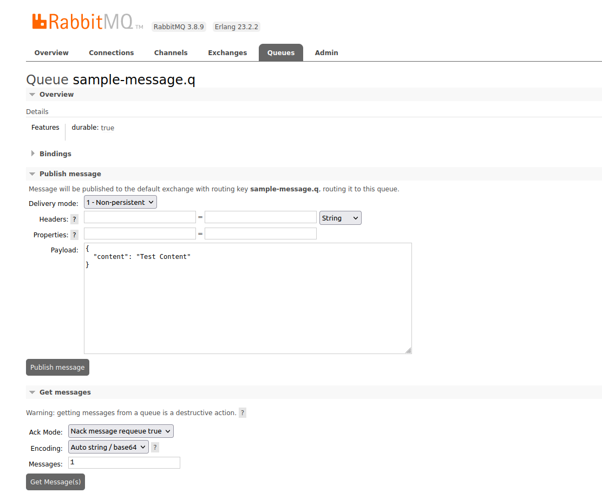
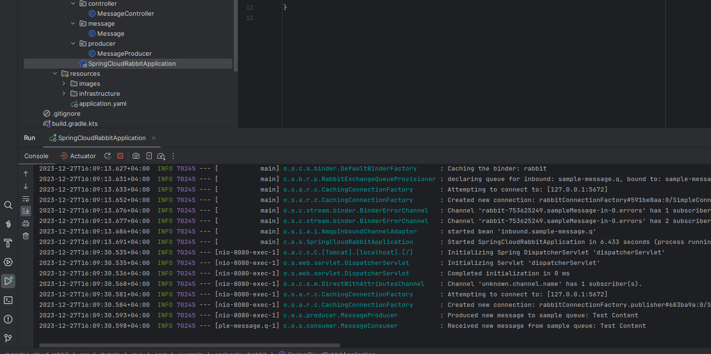

# Sample Spring Cloud Stream

Welcome to the Sample Spring Cloud Stream application! It lets you send and receive 
RabbitMQ messages with ease, thanks to Spring Cloud Stream. Welcome aboard!

## Key Features:
* **Consume Messages From RabbitMQ**
* **Produce Messages to RabbitMQ**
## Technologies Used:
* Java 21
* Spring Cloud Stream
* RabbitMQ
## How To Run?
**Docker Compose** will start **RabbitMQ** container. You should just build application:
```sh
$ ./gradlew bootRun
```
## How To Use?
You can publish message using with 2 ways:

1. Using with this endpoint:
```sh
curl --location 'http://localhost:8080/api/message' \
--header 'Content-Type: application/json' \
--data '{
    "content": "testContent"
}'
```
2. Using with [RabbitMQ Web Management](http://localhost:15672):


   


When you push message to queue you can see this message on logs:


